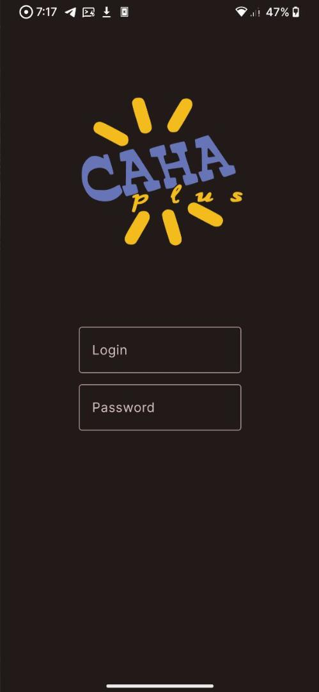
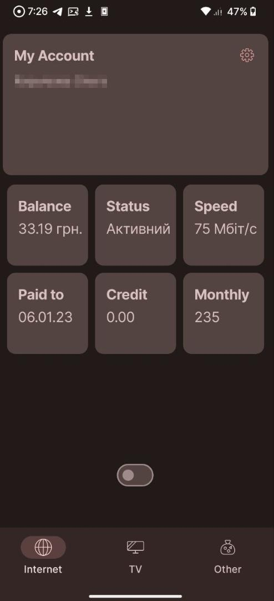

   
# SanaPlus  

SanaPlus app for Odessa provider with Material Design 3 + Monet support 

## Features

- Material Design 3
- Monet support
- Open Source, lol

## Screenshots
 

## Authors

- [@CakesTwix](gitlab.com/CakesTwix)

## Contributing

Contributions are always welcome!

## Links
 

## License
)

